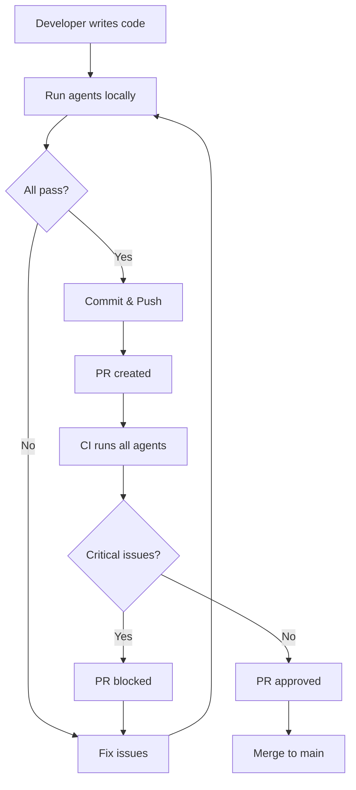

# SaaSForge Review Agents Summary

## 🤖 All Agents Overview

| Agent | Focus Area | Severity Levels | Exit Code on Fail |
|-------|-----------|----------------|-------------------|
| 🔐 **Security** | JWT, mTLS, SSRF, secrets | Critical, High, Medium, Low | Critical/High |
| 🏛️ **Architecture Compliance** | SRS requirements, error codes | Critical, High, Medium, Low | Critical/High |
| 🏗️ **Software Architect** | Three-tier boundaries, patterns | Critical, High, Medium, Low | Critical/High |
| ⚡ **Performance** | N+1 queries, indexes, caching | High, Medium, Low | None (warns only) |
| 🗄️ **Database** | Tenant isolation, migrations | Critical, High, Medium, Low | Critical only |
| 🧪 **Testing** | Coverage, critical paths | High, Medium, Low | Coverage < 60% |

## 📊 Agent Workflow



## 🎯 When to Run Which Agent

### During Development
```bash
# Quick security check before commit
python3 .agents/security/review.py <changed_files>

# Architectural review for new features
python3 .agents/architect/review.py services/cpp/auth/

# Database migration review
python3 .agents/database/review.py db/migrations/005_new_feature.sql
```

### Before Committing
```bash
# Run all agents on changed files
git diff --name-only | xargs python3 .agents/run_all.py

# Or use git hook (recommended)
ln -s ../../.agents/pre-commit.sh .git/hooks/pre-commit
```

### On Pull Requests (Automatic)
All agents run automatically via `.github/workflows/agents.yml`

## 🔍 Understanding Agent Output

### Security Agent Example
```
🔐 Security Review Report
================================================================================
🔴 [CRITICAL] HS256 algorithm detected (use RS256 only)
   Location: services/cpp/auth/src/jwt_validator.cpp:42

🟠 [HIGH] Query missing tenant_id isolation
   Location: api/routers/upload.py:78

Total: 2 issues (1 critical, 1 high)
```

### Architect Agent Example
```
🏗️  Software Architect Review Report
================================================================================
SaaSForge Architecture: React → FastAPI BFF → C++ gRPC Services
================================================================================

🔴 [ARCH-006] [CRITICAL] BFF directly accessing database - use gRPC service
   Location: api/routers/payment.py:45

🟡 [ARCH-014] [MEDIUM] 3 sequential gRPC calls - parallelize with asyncio.gather
   Location: api/routers/dashboard.py:89

Summary by Category:
  ARCH: 2 architectural violations

Total: 2 issues (1 critical, 0 high)
```

## 🛠️ Configuration

All agents configured via `.agents/config.yaml`:

```yaml
# Global settings
severity_threshold: medium  # Minimum severity to report

# Per-agent settings
security:
  enabled: true
  checks:
    jwt_algorithm_whitelist: true
    tenant_isolation: true

architect:
  three_tier_enforcement: strict
  checks:
    layer_separation: true
    communication_patterns: true
```

## 📈 Metrics & Tracking

Track agent effectiveness:

```bash
# Count issues by severity
grep "CRITICAL" .agents/reports/*.log | wc -l

# Issues fixed over time
git log --grep="fix: agent" --oneline | wc -l

# Most common violations
grep -h "\[ARCH-" .agents/reports/*.log | sort | uniq -c | sort -nr
```

## 🚀 Best Practices

1. **Run locally first** - Catch issues before CI
2. **Fix critical/high immediately** - Don't merge with critical issues
3. **Review medium/low periodically** - Address in refactoring sprints
4. **Update config as needed** - Adjust thresholds for your team
5. **Add custom checks** - Extend agents for project-specific rules

## 🤝 Contributing to Agents

To add a new check:

1. Edit appropriate agent in `.agents/<agent>/review.py`
2. Add test case in `.agents/<agent>/test_review.py`
3. Update `.agents/config.yaml` with new check
4. Update documentation in `.agents/README.md`
5. Test with `python3 .agents/run_all.py .`

## 📚 Additional Resources

- **Architecture Rules:** `.agents/architect/ARCHITECTURE_RULES.md`
- **Security Checklist:** `.agents/security/SECURITY_CHECKLIST.md`
- **Quick Start:** `.agents/QUICKSTART.md`
- **SRS Document:** `docs/srs-boilerplate-saas.md`
